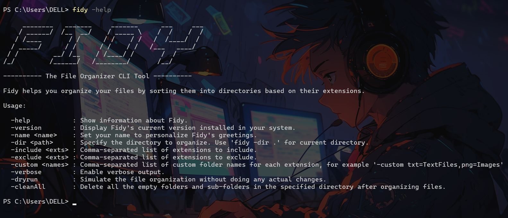

## Introduction:

Ever found yourself drowning in a sea of unorganized files? Fear not, for Fidy is here to save the day! Fidy is a nifty command-line tool built using Go, and it's designed to help you organize your files by their extensions. Whether it's a flood of PDFs or an avalanche of MP3s, Fidy has got you covered.

## The Conception

Every great tool starts with a simple idea. For me, it was the realization that my Downloads folder looked like a digital junkyard. I needed something to bring order to chaos, and what better way than to write a command-line tool? Go, with its simplicity and performance, seemed like the perfect choice for my endeavor.

> **Random Tech Pun:** Why do programmers prefer dark mode? Because light attracts bugs!
{: .prompt-info }

## Setting Up the Go Environment

First things first, we set up our Go environment. If you haven't installed Go yet, hop over to [Go's official site](https://golang.org/dl/) and grab the latest version. With Go installed, we initialize our project:

```terminal
go mod init github.com/username/fidy
```

And thus, Fidy was born! It was time to get our hands dirty with some Go code.

## Coding the Basics

I started with a basic structure for Fidy. The main goal was to organize files by their extensions into corresponding folders. Here’s a snippet of my initial code:

```go
package main

import (
	"flag"
	"fmt"
	"os"
	"path/filepath"
)

func main() {
	dirFlag := flag.String("dir", ".", "Specify the directory to organize")
	verboseFlag := flag.Bool("verbose", false, "Enable verbose mode")
	flag.Parse()

	if *dirFlag != "" {
		if *verboseFlag {
			fmt.Printf("Organizing directory: %s\n", *dirFlag)
		}
		organizeDirectory(*dirFlag, *verboseFlag)
	}
}

func organizeDirectory(dir string, verbose bool) {
	files, err := ioutil.ReadDir(dir)
	if err != nil {
		fmt.Println("Error reading directory:", err)
		return
	}

	createdDirs := make(map[string]bool)

	for _, file := range files {
		if file.IsDir() {
			continue
		}
		ext := filepath.Ext(file.Name())
		extDir := filepath.Join(dir, ext)
		if _, err := os.Stat(extDir); os.IsNotExist(err) {
			os.Mkdir(extDir, os.ModePerm)
			if verbose {
				fmt.Printf("Creating directory: %s\n", extDir)
			}
			createdDirs[extDir] = true
		}
		oldPath := filepath.Join(dir, file.Name())
		newPath := filepath.Join(extDir, file.Name())
		os.Rename(oldPath, newPath)
		if verbose {
			fmt.Printf("Moving %s to %s\n", oldPath, newPath)
		}
	}
}
```
{: file="CLI Tool/Fidy/main.go" }

The dirFlag allows the user to specify the directory that needs to be organized. The directory's files are then iterated by the `organizeDirectory()` function. It extracts the extension name, creates a folder for it and moves the file to the newly created folder. The verbose flag also allows the user to get a detailed output of all the operations performed by Fidy.

#### Example Usage

```terminal
fidy -dir YOUR_DIR -verbose
```

## Adding Bells and Whistles

Once the basics were in place, I added more features like displaying the version and allowing users to name their Fidy instance. Here's how I handled the `-version` flag:

```go
const version = "1.2.2"

func main() {
	versionFlag := flag.Bool("version", false, "Display the version of Fidy")
	flag.Parse()

	if *versionFlag {
		fmt.Printf("Fidy version %s\n", version)
		return
	}

	// Rest of the code...
}
```
{: file="CLI Tool/Fidy/main.go" }

> **Random Tech Pun #2:** Debugging is like being the detective in a crime movie where you are also the murderer.
{: .prompt-info }

## Hurdles and How to Tackle Them

Every project has its share of hiccups, and Fidy was no exception. Here are some hurdles we faced and how we tackled them:

- **File Permissions:** Moving files around requires the right permissions. Always check your permissions and handle errors gracefully.
- **Path Issues:** Hardcoding paths can lead to issues on different systems. We used `filepath` to ensure our paths were system-agnostic.
- **User Experience:** Adding user-friendly messages and handling edge cases made Fidy more robust.

## Making Fidy Public

Once Fidy was polished, I wanted to share it with the world. So I set up a GitHub repository and added a README with clear instructions. I wanted to make an installer executable file for it, so I used [Inno Setup](https://jrsoftware.org/isinfo.php) to create a script for building the installer. The Github repository for Fidy along with the source code and installer can be found [here](https://github.com/ashmit0920/Fidy). Make sure to check it out and give it a try!


_The current version of Fidy_

> **Random Tech Pun #3:** Why did the developer go broke? Because he used up all his cache.
{: .prompt-info }

## Conclusion

Building Fidy was an exciting journey filled with learning and a bit of fun. From setting up Go to tackling hurdles and finally sharing Fidy with the world, every step was worth it. So, the next time your Downloads folder starts looking like a file dumping ground, let Fidy come to the rescue!

Happy coding, and may your bugs be few and your features be many!