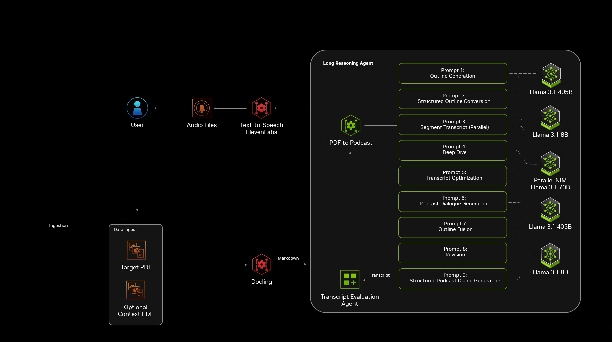

#### Turn PDFs into Podcasts with NVIDIA NIM 🎙️

Ever wished your boring PDFs could just _talk_ to you instead of forcing you to read them? Well, good news! With NVIDIA’s **PDF-to-Podcast Agentic AI Blueprint**, you can convert any PDF into a podcast using AI. This means you can _listen_ to your reports, research papers, or even your boss’s lengthy emails while jogging, cooking, or pretending to be productive.

The full blueprint can be found [here](https://build.nvidia.com/nvidia/pdf-to-podcast).

In this tutorial, we’ll **set up an AI-powered pipeline** that:

1. Extracts text from a PDF
2. Converts it into a structured markdown script
3. Uses AI to generate a natural monologue/dialogue
4. Turns that into an audio podcast using **Text-to-Speech (TTS)**


_The Architecture Diagram for this application_

We’ll use NVIDIA’s **NIM microservices**, **LangChain**, **Docling**, and **ElevenLabs** to make this happen. So, grab some coffee ☕ and let’s get started!

> **Bonus Tip:** Finally, a way to make PDFs talk! Now you can hear things no one ever said to you - just like your imaginary girlfriends :p
{: .prompt-info }

## Setting Up Your Environment

First, ensure you have the required dependencies installed. You’ll need:

- Python 3.9+
- NVIDIA NGC CLI (to pull NIM containers)
- Docker (for running the microservices)
- API access to ElevenLabs for high-quality TTS

## Install Python Dependencies

Run the following command in your terminal:

```bash
pip install langchain openai pypdf docling elevenlabs fastapi uvicorn
```

## Extracting Text from a PDF 📄 → 🔡

We would use a tool called **Docling** to handle the heavy lifting of parsing the PDF content. Once the content is in markdown, it’s ready for the next phase - transforming that plain text into a lively script.

Create a file `pdf_extractor.py`:

```python
import docling
from pathlib import Path

def extract_text_from_pdf(pdf_path):
    doc = docling.Document.from_pdf(pdf_path)
    return doc.to_markdown()

if __name__ == "__main__":
    pdf_file = "sample.pdf"
    markdown_text = extract_text_from_pdf(pdf_file)
    Path("output.md").write_text(markdown_text)
    print("✅ PDF content extracted and saved as markdown!")
```
{: file="agenticAI/pdf_extractor.py" }

Run the script:

```bash
python pdf_extractor.py
```

This will save the extracted content as **output.md** for further processing.

## Generating a Podcast Script Using AI 🤖

Now, let’s use **LangChain** with NVIDIA’s **NIM microservices** to convert the markdown into a structured script.

#### Set Up NVIDIA NIM API Access

First, pull the NIM container (if you haven’t already):

```bash
ngc registry resource download-version "nvidia/nim/meta/llama-3-8b-instruct:latest"
```

Then, start the NIM service with Docker:

```bash
docker run -d --gpus all -p 5001:5001 nvcr.io/nvidia/nim/meta/llama-3-8b-instruct:latest
```

Now, create a new Python file `generate_script.py`:

```python
from langchain.llms import OpenAI
import os

# Set NVIDIA NIM API endpoint
NIM_API_ENDPOINT = "http://localhost:5001/v1/chat/completions"

# Load extracted markdown
with open("output.md", "r") as file:
    content = file.read()

# Prompt for AI to generate a script
prompt = f"""
Convert the following content into a conversational podcast script.
Make it engaging and easy to follow.

{content}
"""

# Call NIM API
def generate_podcast_script():
    llm = OpenAI(model_name="llama-3-8b-instruct", openai_api_base=NIM_API_ENDPOINT)
    response = llm(prompt)
    return response

if __name__ == "__main__":
    script = generate_podcast_script()
    with open("podcast_script.txt", "w") as file:
        file.write(script)
    print("✅ Podcast script generated successfully!")
```
{: file="agenticAI/generate_script.py" }

Run it:

```bash
python generate_script.py
```

This will generate a **natural, engaging podcast script** from your PDF content.

## Convert Text to Speech (TTS) 🎤 → 🔊

Now that we have the podcast script, let’s turn it into audio using **ElevenLabs TTS**.

#### Get Your ElevenLabs API Key

Sign up at [ElevenLabs](https://elevenlabs.io) and get an API key.

#### Convert Script to Speech

Create `tts.py`:

```python
from elevenlabs import generate, save
import os

ELEVENLABS_API_KEY = "your_api_key_here"

def text_to_speech(text, output_file):
    audio = generate(text=text, api_key=ELEVENLABS_API_KEY, voice="Rachel")
    save(audio, output_file)
    print(f"✅ Audio saved as {output_file}")

if __name__ == "__main__":
    with open("podcast_script.txt", "r") as file:
        script_text = file.read()

    text_to_speech(script_text, "podcast.mp3")
```
{: file="agenticAI/tts.py" }

Run the script:

```bash
python tts.py
```

Your **podcast.mp3** is ready!

## Bringing It All Together

To make everything seamless, let’s create a **FastAPI app** so you can convert PDFs into podcasts with a simple API call.

```python
from fastapi import FastAPI, UploadFile
import shutil
import os
from pdf_extractor import extract_text_from_pdf
from generate_script import generate_podcast_script
from text_to_speech import text_to_speech

app = FastAPI()

@app.post("/convert_pdf/")
async def convert_pdf(file: UploadFile):
    file_path = f"uploads/{file.filename}"

    with open(file_path, "wb") as buffer:
        shutil.copyfileobj(file.file, buffer)

    # Extract text from PDF
    markdown_text = extract_text_from_pdf(file_path)

    # Generate Podcast Script
    podcast_script = generate_podcast_script(markdown_text)

    # Convert Script to Speech
    audio_file = "podcast.mp3"
    text_to_speech(podcast_script, audio_file)

    return {"message": "Podcast created!", "audio_file": audio_file}

if __name__ == "__main__":
    import uvicorn
    uvicorn.run(app, host="0.0.0.0", port=8000)
```
{: file="agenticAI/restAPI.py" }

Now run the API server:

```bash
uvicorn app:app --reload
```

#### Test with Postman or Curl

Upload a PDF and get a podcast back!

```bash
curl -X 'POST' 'http://localhost:8000/convert_pdf/' -F 'file=@sample.pdf'
```

## Conclusion 🎧

And that’s it! We just built an **AI-powered pipeline** that turns PDFs into **engaging podcasts** using **NVIDIA NIM**, **LangChain**, and **ElevenLabs**. Now, instead of staring at PDFs, you can _listen_ to them anywhere - whether you’re commuting, working out, or just relaxing.

Some extra features that you could try adding to this project:

- Background music
- Multiple voice styles
- Translation into different languages

Hope you enjoyed this hands-on guide. Now go give your PDFs a voice! 🗣️

**Happy Coding!** 🚀
